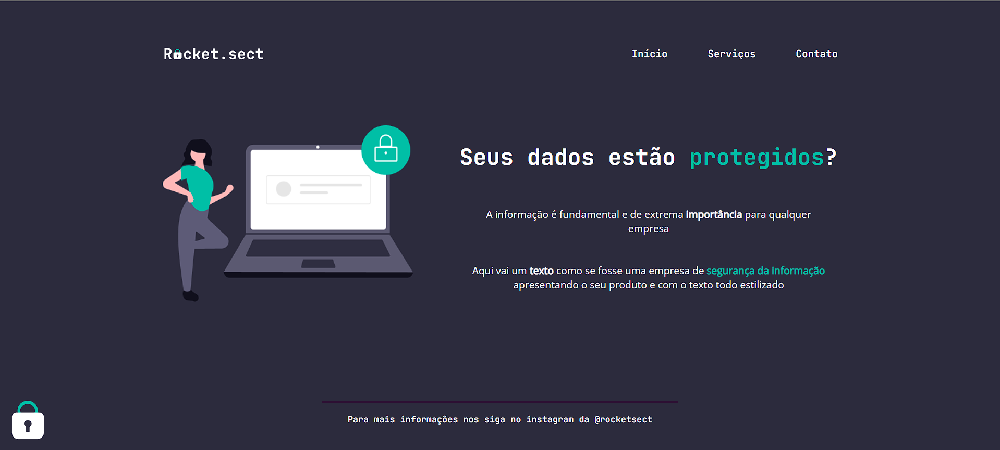

# Rocketseat - Explorer 🪐

>Trilha explorer

Projeto feito no curso explorer da Rocketseat, onde o objetivo era desenvolver um layout do site de uma empresa de segurança da informação, a partir do modelo feito no figma.

[🔗 Clique aqui para acessar](https://tkoch97.github.io/rocket.sect/)

## 🔧 Tecnologias

- HTML
- CSS

## 📪 Contato

>Email: tkoch.gim@gmail.com

>Linkedin: https://www.linkedin.com/in/tkoch97/